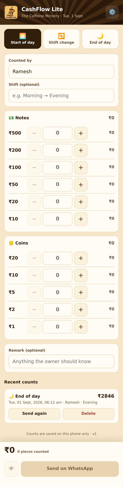

# 🧮 CashFlow Lite

A small phone app for counting the cash drawer at the **start of day**, at
every **shift change** and at the **end of day**. Staff enter how many of each
note and coin they hold, the app adds it up, and one tap sends the full
breakdown to the owner on WhatsApp — **+91 98292 22536**.



No build step, no framework, no server: one HTML file, a service worker and
two images. Everything a count needs stays on the phone that took it.

## Using it

1. Pick **Start of day**, **Shift change** or **End of day**
2. Type your name (it is remembered next time)
3. Enter the quantity for each denomination — type a number, or use the
   **−** / **+** buttons
4. Add a remark if the owner should know something
5. Tap **Send on WhatsApp** — WhatsApp opens with the message ready; tap send

The 👁 button shows the exact message first, and can copy it to the clipboard —
useful if a phone's in-app browser refuses to open WhatsApp directly.

## What the owner receives

```
☕ *The Caffeine Ministry*
🧮 *CASH COUNT · END OF DAY* 🌙
━━━━━━━━━━━━━━━━━━
🗓 Mon, 03 Aug, 2026, 10:45 pm
👤 Counted by: Ramesh
🔁 Shift: Evening

💵 *NOTES*
₹500 × 2 = ₹1000
₹200 × 2 = ₹400
₹100 × 3 = ₹300
₹50 × 2 = ₹100
Notes subtotal: *₹1800*

🪙 *COINS*
₹20 × 5 = ₹100
₹10 × 4 = ₹40
₹2 × 3 = ₹6
₹1 × 5 = ₹5
Coins subtotal: *₹151*

━━━━━━━━━━━━━━━━━━
💰 *TOTAL CASH: ₹1951*
━━━━━━━━━━━━━━━━━━
26 notes & coins counted

📝 Remark: One ₹100 note is torn; kept aside.
```

## Installing it on a phone

Open **https://cashflow-lite-75a83.web.app**, then choose **Add to Home
screen**. It installs as a normal app icon, opens without browser chrome, and
works offline — the service worker keeps a copy, so a count can be entered with
no signal. Only the final WhatsApp hand-off needs a connection.

## Deploying

Either push to `main`, or run **Deploy** from the Actions tab against any
branch. The workflow needs a `FIREBASE_SERVICE_ACCOUNT` secret — see the
comments at the top of `.github/workflows/deploy.yml`.

By hand, from a machine with the CLI:

```bash
npm install -g firebase-tools
firebase login
firebase deploy --only hosting
```

`.firebaserc` pins the project to `cashflow-lite-75a83`, so no `--project` flag
is needed.

## Settings & storage

The owner's number is built in as `+919829222536`. The ⚙️ button on the phone
can change the number and the shop name; those, the last staff name, and the
last 30 counts live in `localStorage` under `tcm-cash-counter` — **on that
phone only**. There is no server, no account and no database, so clearing the
browser data clears the history.

Denominations are the Indian set — ₹500, ₹200, ₹100, ₹50, ₹20 and ₹10 notes,
and ₹20, ₹10, ₹5, ₹2 and ₹1 coins. Change the `DENOMS` list near the top of
the script in `index.html` for a different currency.

## The files

| | |
|---|---|
| `index.html` | the entire app — markup, styles and script |
| `sw.js` | offline shell; page network-first, assets cache-first |
| `manifest.webmanifest` | name, colours and icons for **Add to Home screen** |
| `logo.png` | 512×512 launcher icon |
| `logo-192.png` | 192×192, used for the header badge and older launchers |
| `icon.svg` | maskable fallback icon |
| `404.html` | shown for any unknown path |

Both logo files are resized from the original 1254×1254 artwork, which was
3.1 MB — too heavy to fetch on every open. To change the logo, replace both,
keeping the names and sizes; if either is missing the header falls back to a ☕
and the launcher to `icon.svg`, so a bad file degrades rather than breaks.

The colours throughout are taken from the badge: the poster's sepia ground and
sunburst, the mascot cup's orange, its dark chocolate outline, the cream of its
gloves, and the sage green of the banknotes.

## How the WhatsApp send works

The app opens a `https://wa.me/<number>?text=<message>` link, which hands the
pre-written message to WhatsApp on the phone; the staff member taps send. It
needs no server, no API keys and no WhatsApp Business account, but it is **not**
an unattended send. Delivering without anyone tapping send would need the
WhatsApp Business API and a backend to call it.
